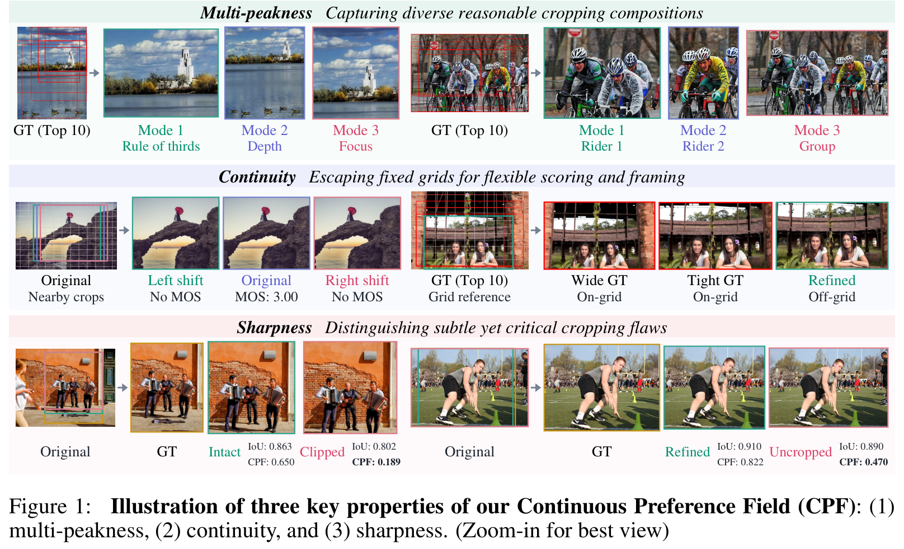
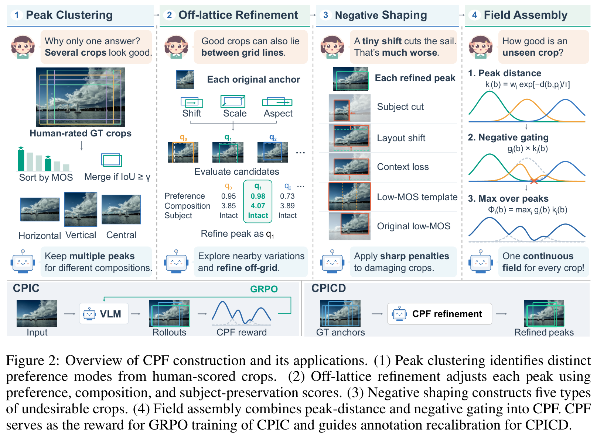
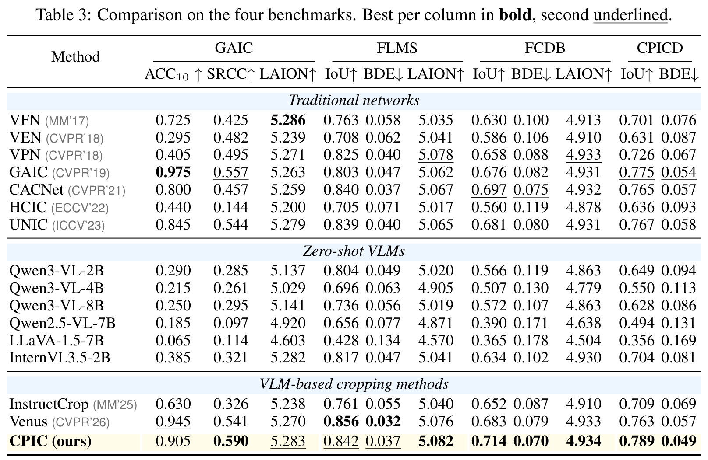
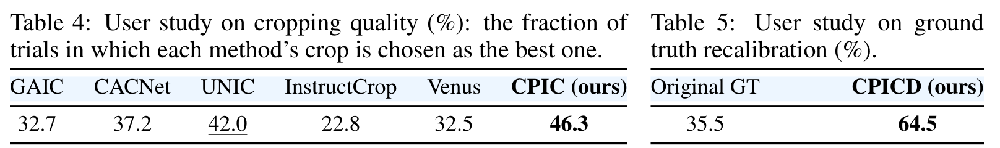
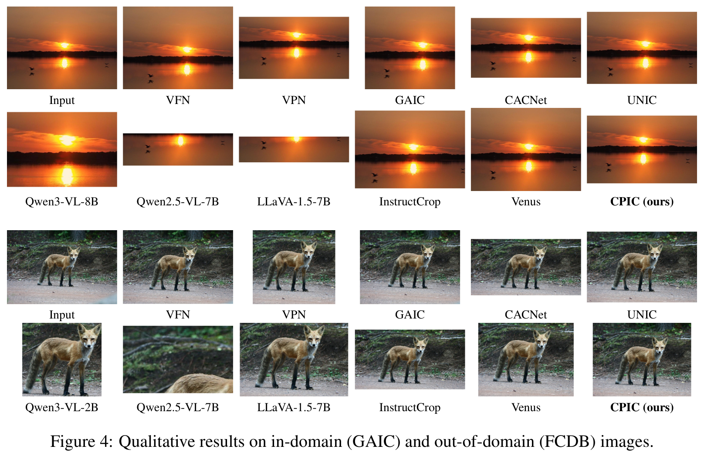
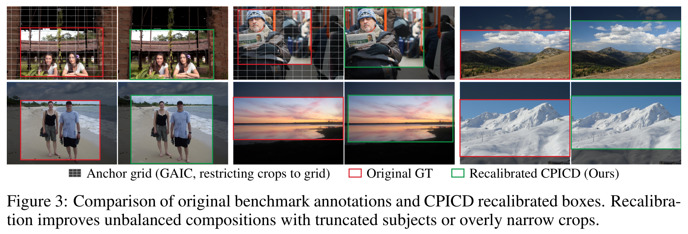
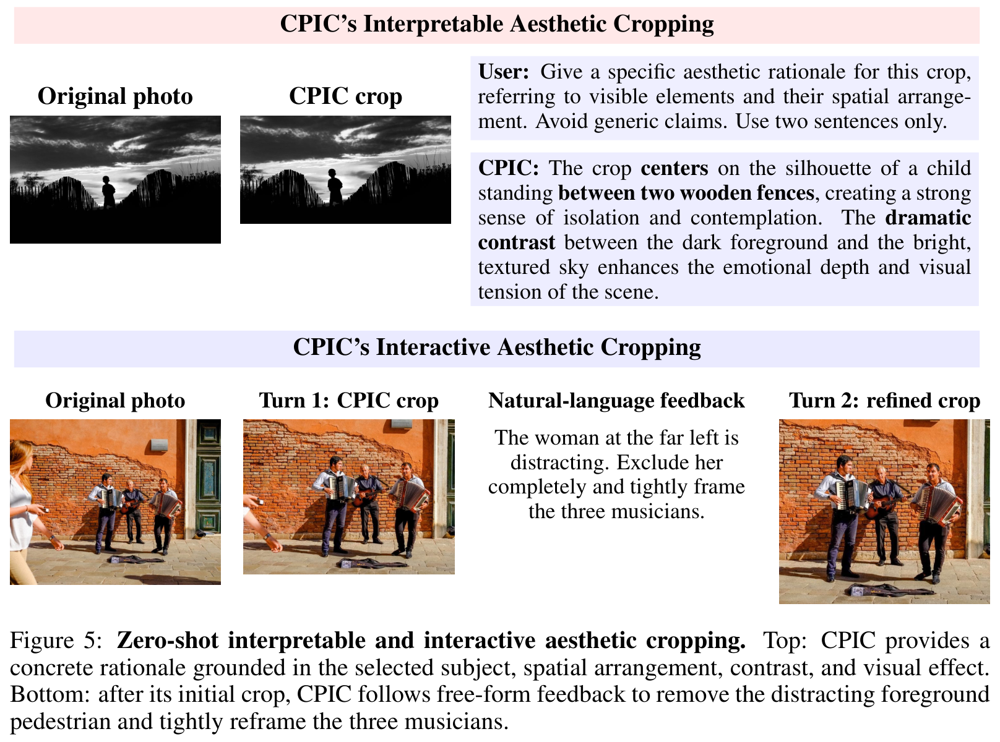
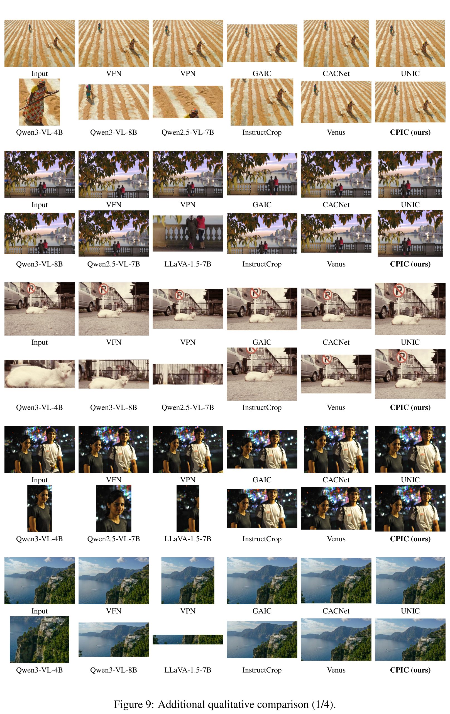
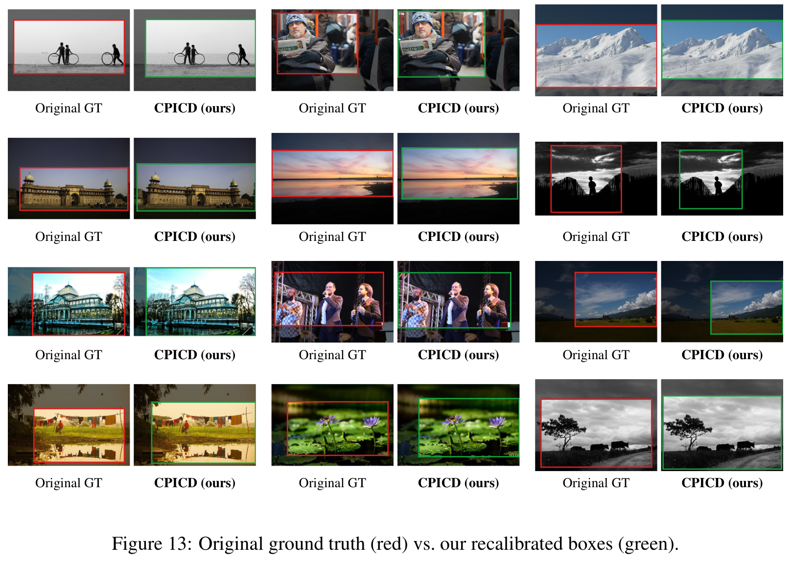

# Discrete Annotation, Continuous Preference: Rethinking Supervision for Accurate and Generalizable Aesthetic Image Cropping (CPIC)

[Ziqing Zhang](https://github.com/zzqingz)<sup>1,*</sup>, Xiao Liu<sup>1,*</sup>, [Kai Liu](https://kai-liu001.github.io/)<sup>1</sup>, Jianze Li<sup>1</sup>, Weihang Zhang<sup>2</sup>, [Linghe Kong](https://www.cs.sjtu.edu.cn/~linghe.kong/)<sup>1</sup>, and [Yulun Zhang](https://yulunzhang.com/)<sup>1,†</sup>

<sup>1</sup> Shanghai Jiao Tong University &nbsp;&nbsp; <sup>2</sup> Institute of Media Technology and Experience Design, Huawei<br>
<sup>*</sup> Equal contribution. <sup>†</sup> Corresponding author.

<div>
  <a href="https://github.com/zzqingz/CPIC"></a>
  <a href="https://github.com/zzqingz/CPIC/stargazers"></a>
</div>

[arXiv] [CPIC pretrained model] [CPICD dataset]

<a id="news"></a>
#### 🔥🔥🔥 News

- **2026-09-30:** The CPIC repository is created. Code, model, and data releases are coming soon.

---

<p align="center">
  
</p>

> **Abstract:** Aesthetic image cropping aims to identify the optimal crop of an image in terms of aesthetics and composition. While supervision based on annotated data is fundamental, the field has been hindered by a long-standing problem: existing datasets suffer from (1) human subjectivity and (2) rigid discreteness confined to fixed sampling grids. These flawed annotations not only limit the accuracy and generalization of trained models but also severely distort fair evaluation. To overcome this, we propose to model human cropping preference as a **multi-peaked, continuous, and sharp** field over the crop space. We introduce the **Continuous Preference Field** (CPF), which recovers a dense preference landscape from discrete annotations through (1) peak clustering, (2) off-lattice refinement, (3) negative shaping, and (4) field assembly. Based on this, we train **CPIC**, a VLM-based cropping model optimized via GRPO with the CPF reward, which overcomes template collapse, achieving state-of-the-art performance and exceptional out-of-domain generalization. Finally, to resolve the long-standing benchmark evaluation crisis, we introduce **CPICD**, a comprehensive recalibration of existing ground-truth boxes. By leveraging the CPF to correct grid-bound artifacts across mainstream benchmarks, CPICD establishes a rigorous and reliable foundation for future cropping research. Extensive experiments and user studies demonstrate the superiority of our CPF, CPIC, and CPICD.

<a id="todo"></a>
## ⚒️ TODO

- [ ] Release paper and supplementary material.
- [ ] Release image-cropping demo and project page.
- [ ] Release the CPICD benchmark.
- [ ] Release pretrained model and inference code.


<a id="contents"></a>
## 🔗 Contents

- [News](#news)
- [TODO](#todo)
- [Contents](#contents)
- [Method](#method)
- [Inference](#inference)
- [Results](#results)
- [Citation](#citation)
- [Acknowledgements](#acknowledgements)

<a id="method"></a>
## 💡 Method

**Continuous Preference Field (CPF)** recovers a multi-peaked, continuous, and sharp preference landscape from discrete crop annotations through four stages: **peak clustering**, **off-lattice refinement**, **negative shaping**, and **field assembly**. The same field supports both **CPIC**, a VLM-based cropping model trained with CPF-guided GRPO, and **CPICD**, a recalibration of benchmark ground-truth boxes.

<p align="center">
  
</p>

<a id="inference"></a>
## 🚀 Inference

### 1. Environment

```bash
conda create -n cpic python=3.11 -y
conda activate cpic
git clone https://github.com/zzqingz/CPIC.git
cd CPIC
pip install torch==2.7.0 torchvision==0.22.0 --index-url https://download.pytorch.org/whl/cu126
pip install -r requirements.txt
```


### 2. Download CPIC

Download the complete **CPIC** checkpoint (approximately 8.5 GB of FP32 model weights, plus tokenizer and processor files). Everything needed for model loading is included in this checkpoint.

The Hugging Face repository is pending release. We will replace `<CPIC_REPO_ID>` below with its published repository ID when available.

```bash
hf download <CPIC_REPO_ID> --local-dir checkpoints/CPIC
```

### 3. Run inference

Single image:

```bash
python inference.py --model checkpoints/CPIC \
    --input /path/to/image.jpg --output results/single
```

Image folder (including subfolders):

```bash
python inference.py --model checkpoints/CPIC \
    --input /path/to/images --output results/folder
```

Supported formats: JPEG, PNG, WebP, BMP, and TIFF. Choose a new output directory outside the input folder for each run. Checkpoints are loaded from local paths; inference does not download files.

Outputs are `crops/` (cropped PNG images, preserving relative folders) and `predictions.json`. Each successful record contains the input image path, original dimensions, model response, `bbox_2d` in the prompted 0–1000 coordinate system, `bbox_xyxy` in original-image pixels, and the crop path. Pixel coordinates retain floating-point precision; saved crops round the top-left corner down and the bottom-right corner up. Failed images are recorded with an `error` field, and the command exits with a nonzero status.

<a id="results"></a>
## 🔎 Results

CPIC achieves state-of-the-art cropping performance and strong out-of-domain generalization. The paper reports quantitative comparisons, human preference studies, and qualitative results on both image cropping and ground-truth recalibration.

<details>
<summary>Click to expand</summary>

- **Quantitative comparison on four benchmarks — Table 3 (main paper)**

<p align="center">
  
</p>

- **Human preference studies — Tables 4 and 5 (main paper)**

<p align="center">
  
</p>

- **In-domain and out-of-domain visual comparison — Figure 4 (main paper)**

<p align="center">
  
</p>

- **Ground-truth recalibration — Figure 3 (main paper)**

<p align="center">
  
</p>

- **Interpretable and interactive cropping — Figure 5 (supplementary material)**

<p align="center">
  
</p>

- **Additional visual comparison — Figure 9 (supplementary material)**

<p align="center">
  
</p>

- **Additional recalibration examples — Figure 13 (supplementary material)**

<p align="center">
  
</p>

</details>

<a id="citation"></a>
## 📎 Citation

If you find this work useful in your research, please cite:

```bibtex
@article{zhang2026cpic,
  title={Discrete Annotation, Continuous Preference: Rethinking Supervision for Accurate and Generalizable Aesthetic Image Cropping},
  author={Zhang, Ziqing and Liu, Xiao and Liu, Kai and Li, Jianze and Zhang, Weihang and Kong, Linghe and Zhang, Yulun},
  journal={arXiv preprint arXiv:xxx},
  year={2026},
  url={https://arxiv.org/abs/xxx}
}
```

The citation will be updated with the arXiv identifier once available.

<a id="acknowledgements"></a>
## 💖 Acknowledgements

Our implementation builds on [Qwen3-VL](https://github.com/QwenLM/Qwen3-VL) and [Transformers](https://github.com/huggingface/transformers). We thank their authors and the creators of the cropping datasets and evaluation baselines used in this work.
